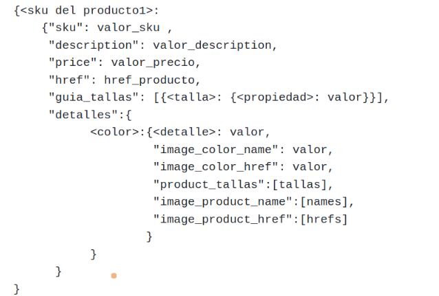

# ScrapyPython
Se hace scrapy a la página es.chein.com

Dada una palabra clave se realiza la búsqueda en el sitio.
Se toma la información de los productos obtenidos en la búsqueda, esta infromación se guarda en un fichero ./json_data/data.json

## Estructura del fichero json


Para cada producto se guarda:
```
           sku: Código sku del producto
   description: Descripción del producto
         price: Precio
          href: url del producto
   guia_tallas: se guardan las propiedades de todas las tallas que puede tener del producto 
      detalles: Según el color del producto se guardan los detalles con su valor,
                el nombre de la imagen que representa el color,
                la ur de la imagen que representa el color,
                las tallas disponibles para ese color,
                los nombres de las imágenes del producto,
                las urls de las imagenes del producto
                      
```

